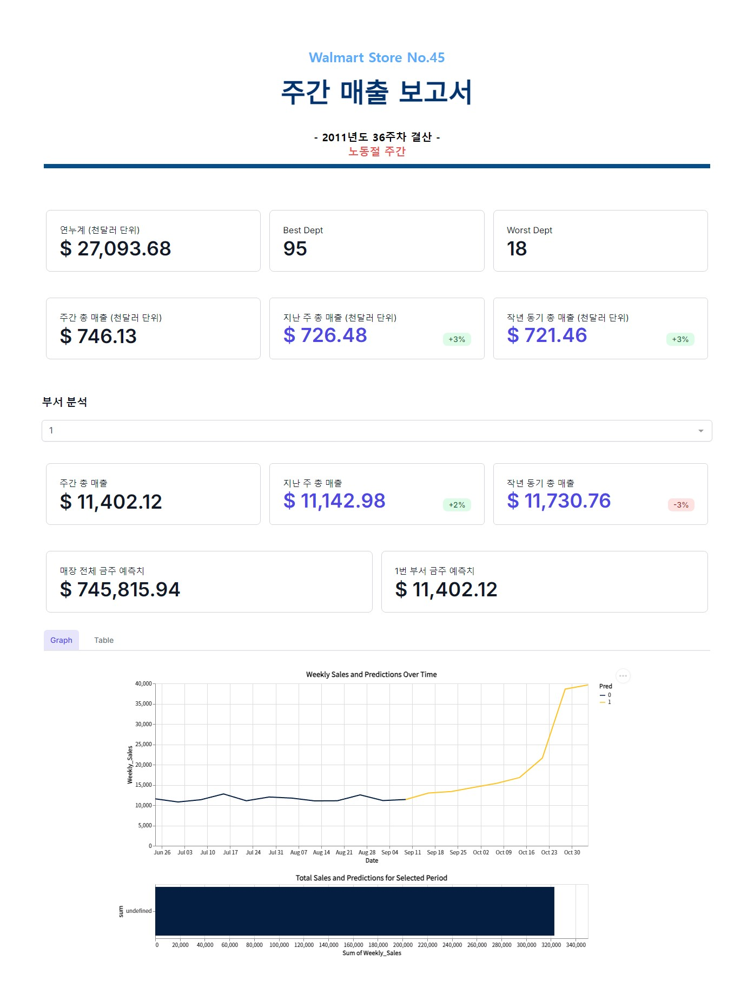

# 🛒 Walmart Store Sales Forecasting

**Walmart 매장의 주간 판매량을 예측하고, 다양한 지표를 통해 분석하는 대시보드입니다.**  
이 프로젝트는 회귀 분석 및 트리 기반 앙상블 모델을 활용해 예측 정확도를 높였습니다.  
> 📊 **데이터 출처:** [Kaggle - Walmart Recruiting - Store Sales Forecasting](https://www.kaggle.com/c/walmart-recruiting-store-sales-forecasting/data)

---

## 🖼️ **프로젝트 스크린샷**
### 📋 **보고서 예시**

- **원하는 연도와 주차** 기준으로 각종 성과 지표를 시각화합니다.  
- **공휴일 주간일 시** 타이틀에 표시됩니다.  
- **부서별 성과 지표** 및 **등감** 분석 가능.  
- **12주간 매출** 및 **8주간 매출 예측**을 동적 그래프로 시각화.  
- **SQL 쿼리 기능이 탑재된 테이블** 제공.

---

## 📈 **최종 모델 설명**

### 🏷️ **XGBoost **
- **모델 설명:**  
  - 최종 모델의 성능은 다음과 같습니다:
    - **R²:** 0.9862  
    - **RMSE:** 2660.32  
    - **WMAE:** 1385.19  

#### 🏷️ **WMAE (Weighted Mean Absolute Error)**
> **WMAE**는 공휴일 주간에 가중치를 5로, 평시에는 1로 두어 예측 정확도를 높입니다.  
> 실제 판매량 (\( y_i \))과 예측 판매량 (\( \hat{y_i} \)) 사이의 절대 오차에 가중치를 부여한 평균 오차를 의미합니다.  
> - **n:** 총 데이터 수  
> - **\( w_i \):** 공휴일 주간일 경우 5, 그 외에는 1  
> - **공식:**  
> \[
> WMAE = \frac{1}{\sum w_i} \sum_{i=1}^{n} w_i |y_i - \hat{y_i}|
> \]  

---

## 📥 **Clone 받는 법**

### **레포지토리 클론**
```bash
git clone 'https://github.com/GwangAnLeeDunKinDonass/Walmart_Store_Sales_Forecasting.git'
```

---

## 🚀 **실행 방법**

### 1. **가상환경 설정 (선택)**
```bash
python -m venv venv
source venv/bin/activate  # Mac/Linux
venv\Scripts\activate     # Windows
```

### 2. **필요 패키지 설치**
```bash
pip install -r requirements.txt
```

### 3. **보고서 생성 및 실행**
#### 📋 심플한 방법
```bash
python walmart_report.py
```
> **입력 안내:** 스토어 번호와 연도, 주차를 순차적으로 입력합니다.

#### 📋 Argument 바로 넣는 방법
```bash
python walmart_report.py --store_num 45 --year_week 2011 36
```

- **store_num:** 매장 번호 (예: 45)  
- **year_week:** 연도와 주차 (예: 2011 36)  
- 생성된 보고서는 `report/` 폴더에 저장됩니다.  

---

## 🛠️ **사용된 기술 스택**
- **GUI:** Datapane  
- **백엔드:** Python  
- **모델:** XGBoost  

---

## 🔗 **참고 링크**
- [Kaggle 대회 페이지](https://www.kaggle.com/c/walmart-recruiting-store-sales-forecasting)
- [Datapane 공식 문서](https://datapane.com/)
- [XGBoost 공식 문서](https://xgboost.readthedocs.io/)

---

**문의사항**은 Issue로 남겨주세요! 🙌
